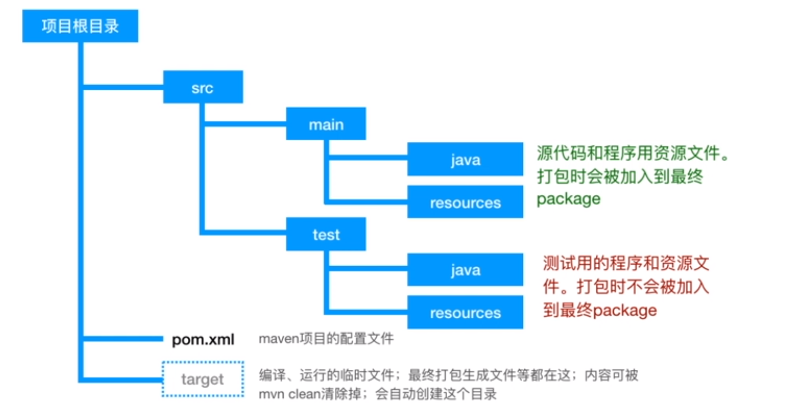

## Maven

#### 项目目录结构

java目录下存储源代码
resources目录下放置一些proptites、xml等配置文件

pom为maven配置文件

#### 常见命令

在pom.xml同级目录下运行

* mvn test 编译并运行测试用例
* mvn spring-boot:run 运行springboot项目
* mvn package 打包项目
* mvn clean 可以和其他命令一起用，例如 mvn clean package