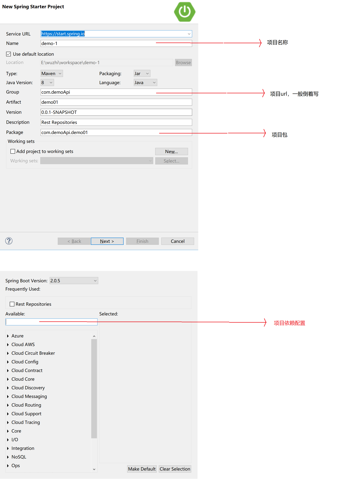

## spingboot-Helloworld

对于springboot项目的构建，官方提供一个网站，可以简单开始，或者使用sts 进行开始springboot项目。

在这里我们使用sts开始springboot项目



我们选择依赖 Rest Repositories

点击完成便构建了一个Springboot项目。

#### HellWord 编写

新建一个DemoController类

```
// 注解Controller，RestController注解会返回json，而Controller可以返回jsp页面
@RestController
// 注解解析路径
@RequestMapping("/demo")
public class DemoController {
	
    // 注解访问方式
	@GetMapping
	public Map<String,Object> sayHello(){
		Map<String,Object> map = new HashMap<>();
		map.put("message","Hello world");
		return map;
	}
}
```

* 日期型转Json格式

    1. 可以在属性上增加 @JsonFormat(timezone="GMT+8",pattern="yyyy-MM-dd")或@JsonFormat(shape=JsonFormat.Shape.NUMBER)

    局限： 需要对每个日期型属性进行配置，如果需要配置的多，较繁琐

    2. 全局修改可以在application.yml

        ```
        spring:
            jackson:
                data-format: yyyy-MM-dd #使用字符串固定格式表示时间
                timezone: GMT+8
                serialization: write-dates-as-timestamps: true #使用数值timeStamps表示日期
        ```

    两个方法可以一起使用，一起使用时，注解优先


#### RestController 热部署、日志、和API测试工具

* 热部署(Hot swapping)

    pom中加入devtools

    ```
    <dependences>
        ...
        <dependency>
            <group>org.springframework.boot</group>
            <artifacId>spring-boot-devtools</artifacId>
            <optional>true</optional>
        </dependency>
    </dependences>
    ```

    实际上时判断class文件的变化，所以是需要sts工具开启自动编译的。

* 记录日志

    - Commons-logging or SLF4j两种工具

        ```
        private static final Log log = LogFactory.getLog(Xxx.class);
        private static final Logger logger = LoggerFactory.getLogger(Xxx.class)
        ```

    - 日志级别： TRACE < DEBUG < INFO < WARN < ERROR < FAIL

    - application.yml配置日志

        ```
        logging:
            file: target/app.log
            level:
                ROOT: WARN
                com.demoAPI.demo: TRACE
        ```

#### 命令行工具CURL
