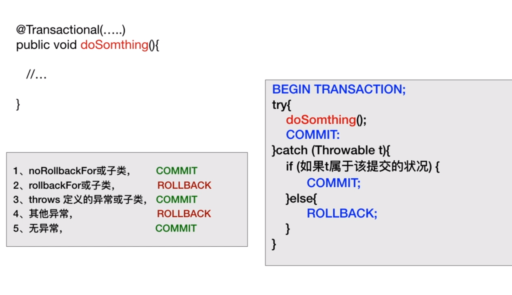
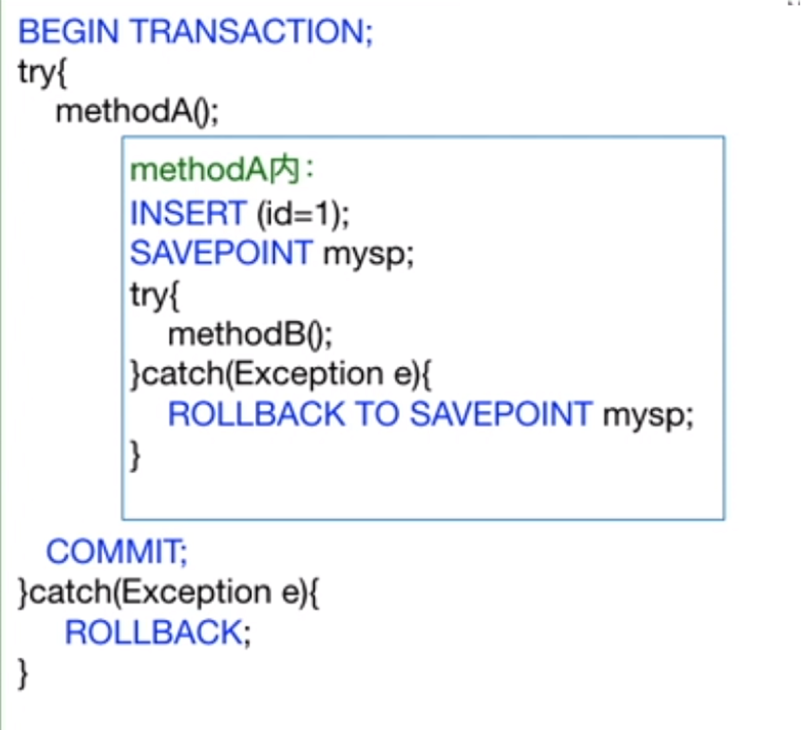
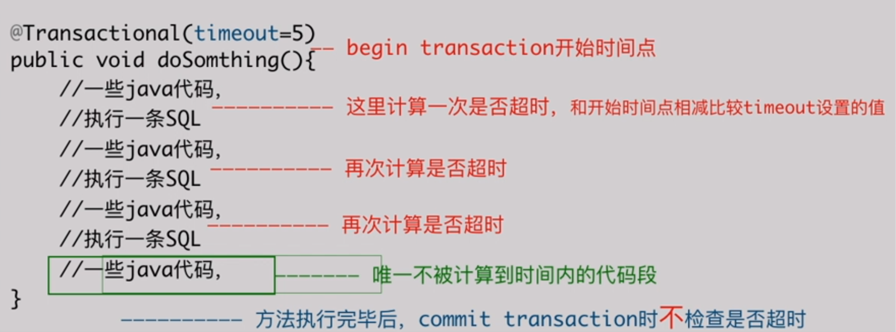

## springboot-事务管理 @Transactional注解

* name  

    当在配置文件中有多个transaction Manager时，可以用该属性指定选择哪个事务管理器

* propgation 

    事务的传播行为，默认为REQUIRED

* isolation

    事务的隔离度，默认为DEFAULT

* timeout

    事务的超时时间，默认-1

    如果超过该时间限制，但事务还未完成，则自动回滚事务

* readOnly

    指定事务是否为只读事务，默认为false

    为了忽略那些不需要事物的方法，比如读取数据，可以设置readOnly为true

* rollbackFor

    指定能够触发回滚的异常类型

* noRollbackFor

    指定不触发事务回滚的异常类型

#### rollbackFor与noRollbackFor

- 
    

    ```
    @Transactional(...)
    public void doSomething(){
        //...
    }
    ```

    spring对事务执行原理

    ```
    BEGIN TRANSACTION;
    try{
        doSomething();
        COMMIT;
    }catch(Throwable t){
        if(如果t属于该提交的状况){
            //  1. noRollbackFor所指定的异常或其子类  COMMIT
            //  2. rollback指定的异常或其子类   ROLLBACK
            //  3. throws 定义的异常或其子类    COMMIT
            //  4. 其他异常     ROLLBACK
            //  5. 无异常       COMMIT
            COMMIT;
        }else{
            ROLLBACK;
        }
    }
    ```

    例如：

    ```
    public void payOrderAndNotify(Order order){
        // 1.   查询用户余额
        //      计算余额
        //      扣减余额
        //      可能抛出RuntimeExcetion，但不会有WebServiceException
        //      更新订单状态

        // 2.   第二部分即使出现异常，也需要提交前面的事务
        //      调用外部服务，发送订单信息给仓库，以便仓库系统处理
        //      可能抛出WebServiceException
        //      可能抛出一些自定义异常
    }

    @Transactional(rollbackFor=RuntimeException.class,
                    noRollbackFOr=WebServiceException.class)
    public void payOrderAndNotify(...) throws Exception {...}
    ```


#### @Transactional(propagation=XX)

-   取值

    * Propagation.REQUIRED  如果有事务，那么加入事务，没有的话，新建一个事务(默认)
    * Propagation.NOT_SUPPORTED 容器不为这个方法开启事务
    * Propagation.REQUIRES_NEW 不管是否存在事务，都创建一个新的事务，原来的事务挂起，新的事务执行完毕，继续执行老的事务
    * Propagation.MANDATORY 必须在一个已有的事务中执行(执行前，已经开启了一个其他事务)，否则抛出异常
    * Propagation.NERVER 必须在一个没有的事务中执行(执行前没有事务)，否则抛出异常
    * Propagation.SUPPORTS 如果其他bean调用这个方法，在其他bean中声明事务，那就用事务；如果其他bean没有声明用事务，那就不用事务
    * Propagation.NESTED 如果存在当前事务，则在嵌套事务内完成。如果没有，则进行与Propagation.REQUIRED类似的操作

- 例如

    1. 方法A调用方法B时，已经存在一个方法A开启的事务，则B会加入A开启的这个事务中执行，所以记录1和2，会全部提交或全部回滚。不会只保存一个。

    ```
    public class CA{
        @Autowired CB cb;

        @Transactional(propagation=Propagation.REQUIRED)
        public void methodA(){
            //其他操作，比如插入一条记录 ID=1
            ...
            cb.methodB();
        }
    }

    public class CB{
        @Transactional(propagation=Propagation.REQUIRED)
        public void methodB(){
            //其他操作，比如插入一条记录 ID=2
            ...
        }
    }
    ```

    2. 调用方法B时，CA的方法A已经开启了一个事务，此时，方法B会重新建立一个新的事务，而老的事务会挂起，等方法B的事务执行完成后在继续执行。

    方法B执行完成后，对应的事务就会被提交，如果方法A在执行玩B之后抛出异常，只有方法A对应的事务会进行回滚，数据库内会留下ID=2的记录。

    ```
    public class CA{
        @Autowired CB cb;

        @Transactional(propagation=Propagation.REQUIRED)
        public void methodA(){
            //此处插入一条记录 ID=1
            ...
            cb.methodB();
            // 此处抛出一个异常
            ...
        }
    }

    public class CB{
        @Transactional(propagation=Propagation.REQUIRES_NEW)
        public void methodB(){
            //此处插入一条记录 ID=2
            ...
        }
    }
    ```

    3. NESTED是开启一个嵌套事务。即这段代码为：

        方法A开启一个事务进行插入记录1，然后方法B开启一个子事务插入记录B。如果方法B内部抛出异常，则只对子事务进行回滚。而如果方法A中抛出异常，则整个事务进行回滚。

        对于嵌套事务，是不能独立提交的，但是能够独立回滚。即子事务可以失败回滚，失败回滚对主事务无影响，但是成功需要依赖主事务的共同成功才得以提交。

    

    ```
    public class CA{
        @Autowired CB cb;

        @Transactional(propagation=Propagation.REQUIRED)
        public void methodA(){
            //此处插入一条记录 ID=1
            ...
            cb.methodB();
        }
    }

    public class CB{
        @Transactional(propagation=Propagation.NESTED)
        public void methodB(){
            //此处插入一条记录 ID=2
            //此处抛出一个异常 
            ...
        }
    }
    ```

#### @Transactional(isolation=XX)

- 取值

    * Isolation.READ_UNCOMMITED     读未提交
    * Isolation.READ_COMMITED       读已提交
    * Isolation.REPEATABLE_READ     可重复读
    * Isolation.SERIALIZABLE        序列化
    * Isolation.DEFAULT             使用数据库默认


- 使用

    当选择隔离级别较高的等级，需要有出错重试机制

    如：

    ```
    public class XxxServeice{
        @Transcation(isolation=Isolation.SERIALIZABLE)
        public void doSomething(){
            ...
        }
    }

    public class YyyService{
        @Autowired XxxService xxxServ;
        
        public void tryTodo(){
            boolean success = false;
            for(int i = 0;i < MACTRY; i++){
                try{
                    xxxServ.doSomething();
                    success=true;
                    break;
                }catch(SQLExcetion e){
                    //执行失败，需要再次尝试
                }
            }
            if(!success){
                //为执行成功，进行失败后处理
            }
        }
    }
    ```

#### @Transactional(timeout=XX)

- timeout 的默认值为-1，即不设置超时。
- 方法抛出异常，事务被回滚，可能是SQL执行中的异常，也可能是TransactionTimedOutException
- 从方法执行开始计算，每个SQL执行前检查一次是否超时，方法全部执行完毕后不检查是否超时

   